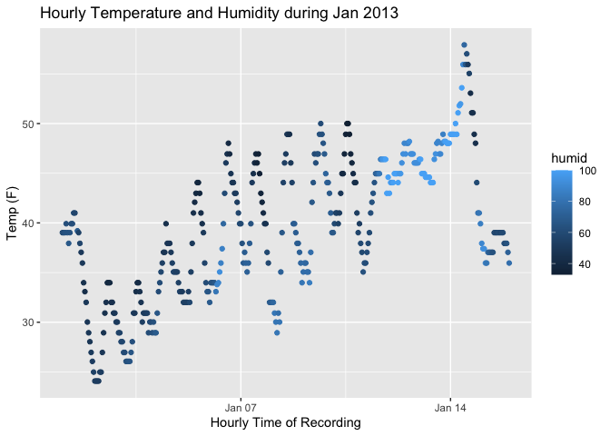

p8105_hw1_sdc2157
================
Stephanie Calluori
2023-09-23

``` r
library(moderndive)
library(tidyverse)
```

    ## ── Attaching core tidyverse packages ──────────────────────── tidyverse 2.0.0 ──
    ## ✔ dplyr     1.1.3     ✔ readr     2.1.4
    ## ✔ forcats   1.0.0     ✔ stringr   1.5.0
    ## ✔ ggplot2   3.4.3     ✔ tibble    3.2.1
    ## ✔ lubridate 1.9.2     ✔ tidyr     1.3.0
    ## ✔ purrr     1.0.2     
    ## ── Conflicts ────────────────────────────────────────── tidyverse_conflicts() ──
    ## ✖ dplyr::filter() masks stats::filter()
    ## ✖ dplyr::lag()    masks stats::lag()
    ## ℹ Use the conflicted package (<http://conflicted.r-lib.org/>) to force all conflicts to become errors

# Problem 1

For this exercise, we will be examining the early_january_weather
dataset, which catalogs hourly weather data for LGA, JFK, and EWR
airports during January 2013.

``` r
data("early_january_weather")
```

The data set contains 358 observations and 15 variables. Variables
include origin, year, month, day, hour, temp, dewp, humid, wind_dir,
wind_speed, wind_gust, precip, pressure, visib, time_hour .

Next, we will examine some key variables.

``` r
temp_vec <- pull(early_january_weather, temp)
wind_speed_vec <- pull(early_january_weather, wind_speed)
visib_vec <- pull(early_january_weather, visib)
```

The average temperature was 39.6 degrees F with a standard deviation of
7.1degrees F. The minimum and maximum temperatures were 24.1and 57.9,
respectively.

Some additional values of note include average wind speed at 8.2 mph,
and average visibility at 8.5 miles.

## Time for plotting!

``` r
ggplot(early_january_weather, aes(x = time_hour, y = temp, color = humid)) + 
  geom_point() +
  labs(y = "Temp (F)" , x = "Hourly Time of Recording", title = "Hourly Temperature and Humidity during Jan 2013")
```

<!-- -->

``` r
ggsave("scatterplot.pdf")
```

    ## Saving 7 x 5 in image

Figure 1: Hourly Temperature and Humidity during Jan 2013. While regular
fluctuations in temperature occurred, an overall increase in temperature
was observed from early to mid-January. Relative humidity was low, and
then considerably increased near mid-January.

# Problem 2

Next, we will explore variable types. First, we will create a dataframe.

``` r
set.seed(10)

example_df <-
  tibble(
    vec_num = rnorm(10),
    vec_logical = (vec_num > 0),
    vec_char = 1:10,
    vec_factor = factor(c("small", "small", "medium", "large", "medium", "large", 
                          "small", "large", "large", "large"),
                        levels = c("small", "medium", "large")
                        )
  )
```

Here’s a **code chunk** that samples from a *normal distribution*:

``` r
samp = rnorm(100)
length(samp)
```

    ## [1] 100

# Section 2

I can take the mean of the sample, too! The mean is -0.0833011.
